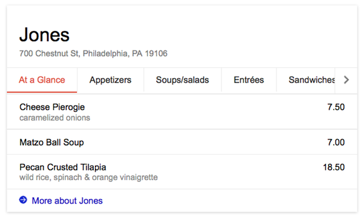
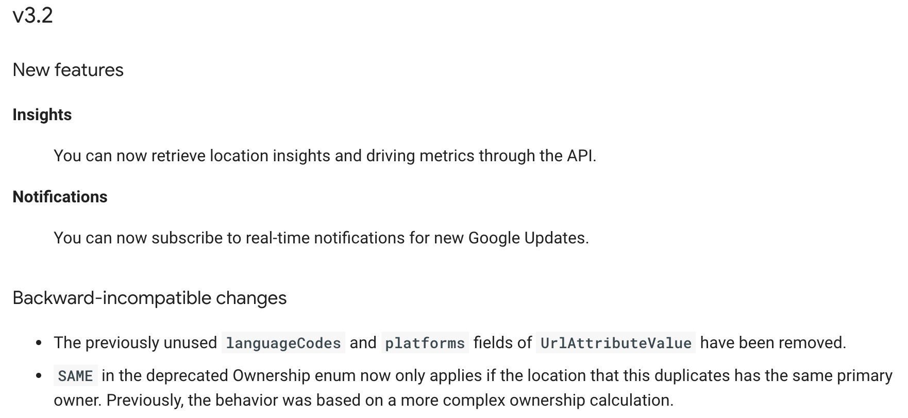
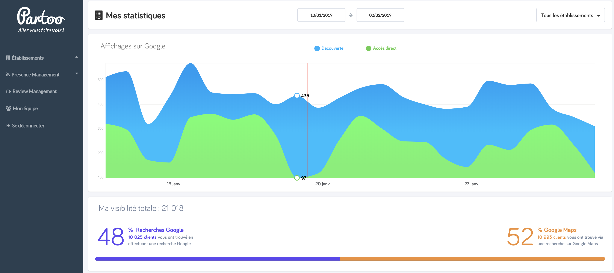
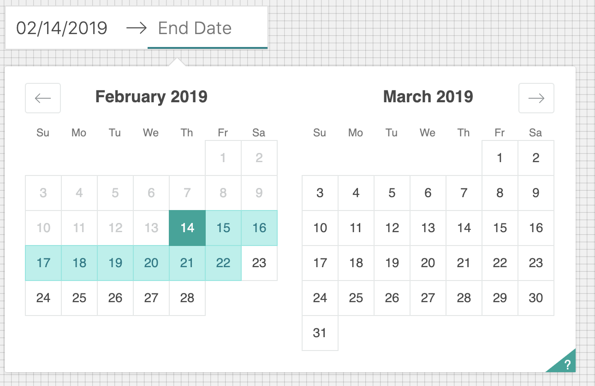

title: Insights Dashboard Presentation
author:
  name: Philip Kubiak
  url: https://github.com/tucobenedicto
output: basic.html
controls: true

--
<br>
## **Insights Dashboard**

<br><br><br>
## A small look  👀  into one of my projects while @ partoo.fr
## *Bauer Xcel Media, Feb. 15, 2019*

--

# 
## **...Qu'est-ce que c'est??** 🤔

--

Mission statement, from www.partoo.fr:

*Today, one out of three Internet researches is linked to a local activity, such as when you search in Google your activity (for example, "**Paris 12th arrondissement hairdresser**").*

--

Continued...

*Every day, dozens of millions of people are looking for places like yours on online directories, review websites, social networks, specialized websites or search engines. Thanks to Partoo, your business' information is shown on all the platforms where your potential customers can reach you. You can also start to follow what's being said about your local business on these platforms!*

--

~~Mission statement, from www.partoo.fr:~~

Mission statement, from Philip 👨‍💻

--

## 
[Source](https://www.partoo.fr/en/): partoo.fr/en

--

One of these platforms drives *significantly* more local search than the others...

--

One of these platforms drives *significantly* more local search than the others...

* starts with a *G*... 🤔

--

One of these platforms drives *significantly* more local search than the others...

* starts with a *G*... 🤔
* ends with a *-oogle My Business* 🤔

--

## 
<br>
## 
## **G Suite:** Google My Business

--

<br>
**Google's share** of search engine queries, 2018

- 🇫🇷 France: **91.2%**
- 🇺🇸 USA: **87.3%**

<br><br>
[Source](https://alphametic.com/global-search-engine-market-share): Alphametic's 2018 StatCounter Study

--

# [ruth chris lincoln harbor](https://www.google.com/search?q=ruth+chris+lincoln+harbor)

--

## 
<br>
## [Source](https://searchengineland.com/google-showing-restaurant-menus-card-style-search-result-184066) Search Engine Land

--

<h1>*le* Problem</h1>

--

<h1>*le* Solution</h1>

--

## 

[Source](https://developers.google.com/my-business/content/change-log): Google My Business API Change Log Release Notes

--

<br><br>
#### We should work on this _______?

--

<br><br>
#### We should work on this ASAP on our product roadmap 👍

--

<br>
### Demonstration
<br>
How the ⚙️ 's turn @ Partoo in designing, managing, developing a project.

--

**Phil**: I'm the dev 👨‍💻 on the project.

--

**Phil**: I'm the dev 👨‍💻 on the project.

**Ben**: I'm the manager 🕵️‍♂️ on the project.

--

**Phil**: I'm the dev 👨‍💻 on the project.

**Ben**: I'm the manager 🕵️‍♂️ on the project. I'll plan out Phil's taskmap with him.

--

**Phil**: I'm the dev 👨‍💻 on the project.

**Ben**: I'm the manager 🕵️‍♂️ on the project. I'll plan out Phil's taskmap with him.
<br> ... also I'll (QA) test the product when it's deployed to Staging.

--

**Phil**: I'm the dev 👨‍💻 on the project.

**Ben**: I'm the manager 🕵️‍♂️ on the project. I'll plan out Phil's taskmap with him.
<br> ... also I'll (QA) test the product when it's deployed to Staging.
<br> ... also I'm the CPO!

--

**Phil**: I'm the dev 👨‍💻 on the project.

**Ben**: I'm the manager 🕵️‍♂️ on the project. I'll plan out Phil's taskmap with him.
<br> ... also I'll (QA) test the product when it's deployed to Staging.
<br> ... also I'm the CPO!

**Matthias**: I'm the designer 👨‍🎨! I'll work on the prototype while you get started on the back-end!

--

<br><br><br>
**Ben**: Hey Phil, let's get together our Trello cards. 

--

 ---
**Trello Card: Our End-user/Dev/Micro-service story**

Passing Criteria:
#### ___
#### ___

 ---

--

 ---
**Trello Card: Google Insights SQLAlchemy Model**

 ---

--

```json
{
  "locationMetrics": [
    {
      "locationName": "accounts/123xxx/locations/123xxx",
      "timeZone": "Europe/Paris",
      "metricValues": [
        {
          "metric": "QUERIES_DIRECT",
          "dimensionalValues": [
            {
              "metricOption": "AGGREGATED_DAILY",
              "timeDimension": {
                "timeRange": {
                  "startTime": "2018-05-01T22:00:00Z"
                }
              },
              "value": "95"
            },
            {
              "metricOption": "AGGREGATED_DAILY",
              "timeDimension": {
                "timeRange": {
                  "startTime": "2018-05-02T22:00:00Z"
                }
              },
              "value": "94"
            }
          ]
        },
        {
          "metric": "QUERIES_INDIRECT",
          "dimensionalValues": [
            {
              "metricOption": "AGGREGATED_DAILY",
              "timeDimension": {
                "timeRange": {
                  "startTime": "2018-05-01T22:00:00Z"
                }
              },
              "value": "5"
            },
            {
              "metricOption": "AGGREGATED_DAILY",
              "timeDimension": {
                "timeRange": {
                  "startTime": "2018-05-02T22:00:00Z"
                }
              },
              "value": "7"
            }
          ]
        }
      ]
    }
  ]
}
```

--
<br>
```python
# db/models/analytics.py
class Analytics(Base):
    business_id = Column(String, primary_key=True, nullable=False)
    date = Column(Date, primary_key=True, nullable=False)
    partner = Column(String, primary_key=True, nullable=False)
    partner_business_id = Column(String, nullable=False)
    timezone = Column(String)
    queries_direct = Column(Integer, default=0)
    queries_indirect = Column(Integer, default=0)
    views_maps = Column(Integer, default=0)
    views_search = Column(Integer, default=0)
    actions_website = Column(Integer, default=0)
    # ...
```

--

*Back-end qualifiers*
- script to fetch endpoint from Insights API (w/ authentication), format to `db.models.Analytics`, save
- CRON run script every day and generate report
	- failures logged in report and to Sentry
- hook on `db.models.Businesses` creation to pull max Insights possible on new businesses signing up w/ Partoo

--

**Matthias**: 👋 Hey, here's our Invision prototype for the project.

--

**Matthias**: 👋 Hey, here's our Invision prototype for the project.
<br> ... I'm the designer, remember?

--

*New!* API resource: <ins>Analytics</ins>.

--

*New!* API resource: <ins>Analytics</ins>.

- apply the same permissions for roles as <ins>Businesses</ins>

--

*New!* API resource: <ins>Analytics</ins>.

- apply the same permissions for roles as <ins>Businesses</ins>
- at SQL query, convert `DATE` to `TIMESTAMP WITH TIMEZONE` on `Analytics.timezone`

--

<br><br>
Cool.
<br><br>👀 **But what will all this end up looking like?**

--

## 
[Source](https://www.partoo.fr/en/): partoo.fr

--

## 
[Source](https://www.partoo.fr/en/): partoo.fr

Which components?

--

## [Airbnb React-dates Date Picker](https://github.com/airbnb/react-dates)

## 

--

Graphing library we can use with React
- `$ npm install react-linechart`
- `$ npm install react-chartkick`
- `$ npm install recharts`

--

Graphing library we can use with React
- `$ npm install react-linechart`
- `$ npm install react-chartkick`
- `$ npm install recharts`
- ...

--

# [d3.js](https://d3js.org/)

--

<br>
*le* <ins>**D•O•M**</ins>

--

<br>
*le* <ins>**D•O•M**</ins>

**React**: Hey, let me touch that!
<br>**d3**: Hey, me too!

--

# `<svg/>`,<br>& refs

--

**d3 API**
- `d3-shape`, `d3-scale`, `d3-path`, ...
- lines, fills, shapes API
- x, y axis domain & range
- ~~`d3-selection`~~

<br>
**React `render()`**
- `<svg/>`
- `onMouseHover()`, `onFocus`

--

→ Back to front end application/application overall.
- check for request concurrency (redux-saga), paginations
- heavy load test as much as possible
- repeat above for a deploy to staging

--

Nice-to-have 🙏:

 ...more load testing! Post-deploy stress testing (staging)!

--

### U.X. Design 🕶
 → lessons learned
- user "lands" on the page, give them something actionable
- don't busy your application to make every possible data fetch, where it's not realistic

--

### U.X. Design 🕶
 → lessons learned
- user "lands" on the page, give them something actionable
- don't busy your application to make every possible data fetch, where it's not realistic
- if you do that, *further optimizations needed than what I pushed to Staging and then Production!*
    - optimize db query with timezone
    - websocket
    - at least concurrency